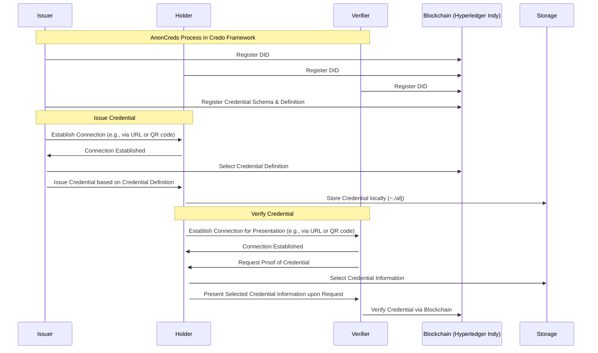
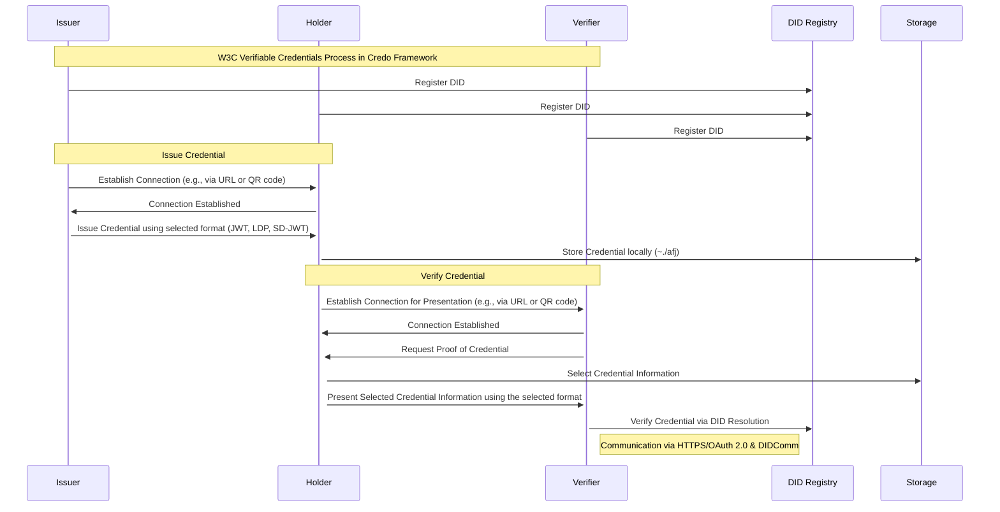

# Credo に関するの調査

## 概要

- Credo は、分散型 ID と検証可能なクレデンシャルを構築するための TypeScript フレームワークです。元々 Aries Framework JavaScript の一部として開発され、現在は Open Wallet Foundation によって管理されています。

## 開発言語

- TypeScript で開発しており、Node.js 及び React Native をサポートしています。

## 自作ウォレットのサポート

- Credo は、SSI（Self-Sovereign Identity）フレームワークとして、開発者がサーバー、クライアント、モバイルアプリ向けに自作ウォレットを構築できるようサポートしています。
  - モバイルアプリ
    - React Native
  - サーバー、クライアント
    - TypeScript/Node.js

## サポートされているクレデンシャル形式

1. [Anoncreds](https://github.com/openwallet-foundation/credo-ts/blob/main/demo/src/BaseAgent.ts#L7)
2. [W3C VC](https://github.com/openwallet-foundation/credo-ts/blob/main/packages/openid4vc/src/shared/models/OpenId4VciCredentialFormatProfile.ts)
   1. JWT
   2. SD-JWT (Selective Disclosure JWT)
   3. LDP (Linked Data Proofs)
   4. JSON-LD (JSON for Linking Data)

## サポートされている通信・認証プロトコル

### 通信プロトコル

1. DIDComm
2. DidExchange protocol
3. Connections Protocol

### 認証プロトコル

1. OAuth 2.0
2. OIDC (OpenID Connect)
3. SIOPv2 (Self-Issued OpenID Provider v2)

### クレデンシャル交換プロトコル

1. OIDC4VCI (OpenID Connect for Verifiable Credential Issuance)
2. OIDC4VP (OpenID Connect for Verifiable Presentations)
3. Presentation Exchange
4. DIF Presentation Exchange
5. Issue credential protocol
6. Present Proof Protocol

### 参照コード

- https://github.com/openwallet-foundation/credo-ts/tree/main/packages/core/src/modules/didcomm
- https://github.com/openwallet-foundation/credo-ts/tree/main/packages/core/src/modules/connections
- https://github.com/openwallet-foundation/credo-ts/tree/main/packages/core/src/modules/dif-presentation-exchange
- https://github.com/openwallet-foundation/credo-ts/tree/main/packages/core/src/modules/proofs/protocol
- https://github.com/openwallet-foundation/credo-ts/tree/main/packages/core/src/modules/credentials/protocol
- https://github.com/openwallet-foundation/credo-ts/tree/main/packages/core/src/modules/vc/models/

## シーケンス図

### フローチャート

#### AnonCreds

#### OID4VC

### VC 発行、VC／VP 検証に関しての大まかな流れ

1. エージェントの設定
   - Credo では、各参加者は自分のエージェントの設定が必要です。これらのエージェントは、VC 発行、検証、管理などの活動を担当します。
2. 接続の確立
   - VC を発行または検証する前に、エージェント間の接続を確立する必要があります。
3. VC の発行
   - Issuer は Holder と間の接続を確立してから、Issuer は特定の声明や属性を含む VC を生成し、Holder に送信します。
4. VC の保存及び管理
   - Holder が VC を受け取ってから、データは `~/.afj` に保存されます。（将来、`~/.credo` に変更される予定です。）
     - [参照 リンク](https://github.com/openwallet-foundation/credo-ts/issues/1715)
5. VC／VP の検証
   - Verifier は Holder と間の接続を確立してから、Verifier は Holder に特定の VC の提示を求めて、Holder はその VC を提供します。

## ライブラリ

- [@credo-ts/core](https://www.npmjs.com/package/@credo-ts/core)
- [@credo-ts/node](https://www.npmjs.com/package/@credo-ts/node)
- [@credo-ts/react-native](https://www.npmjs.com/package/@credo-ts/react-native)
- [@credo-ts/indy-vdr](https://www.npmjs.com/package/@credo-ts/indy-vdr)
- [@credo-ts/cheqd](https://www.npmjs.com/package/@credo-ts/cheqd)
- [@credo-ts/askar](https://www.npmjs.com/package/@credo-ts/askar)
- [@credo-ts/anoncreds](https://www.npmjs.com/package/@credo-ts/anoncreds)
- [@credo-ts/openid4vc](https://www.npmjs.com/package/@credo-ts/openid4vc)
- [@credo-ts/action-menu](https://www.npmjs.com/package/@credo-ts/action-menu)
- [@credo-ts/question-answer](https://www.npmjs.com/package/@credo-ts/question-answer)
- [@credo-ts/tenants](https://www.npmjs.com/package/@credo-ts/tenants)

## コミュニティの活動状況

- Credo は、Hyperledger コミュニティからの活動を引き継ぎ、OpenWallet Foundation への移行後もその活動を続けるオープンソースコミュニティを維持しています。GitHub において、239 のスターと 178 のフォークが寄せられ、このプロジェクトへの広範な関心と活発な参加が示されています。現在、136 件のイシューがオープンされており、さらに 25 件のプルリクエストが進行中です。これらの数字は、Credo コミュニティの活動が非常に活発であることを示しています。

## サンプル

1. [AnonCreds Demo](https://github.com/openwallet-foundation/credo-ts/tree/main/demo)
   1. 前提条件
      - Node.JS v18 をインストールされたこと
      - Yarn をインストールされたこと
      - Hyperledger Indy ネットワークと indy-sdk に依存されます。
        - [indy-sdk を構築](https://credo.js.org/guides/getting-started/set-up/indy-sdk)
        - [indy-network を構築](https://github.com/bcgov/von-network?tab=readme-ov-file#running-the-web-server-on-your-local-machine)
   2. 主なライブラリ（パッケージ）
      - [@credo-ts/core](https://www.npmjs.com/package/@credo-ts/core)
      - [@credo-ts/node](https://www.npmjs.com/package/@credo-ts/node)
      - [@credo-ts/indy-vdr](https://www.npmjs.com/package/@credo-ts/indy-vdr)
      - [@credo-ts/cheqd](https://www.npmjs.com/package/@credo-ts/cheqd)
      - [@credo-ts/askar](https://www.npmjs.com/package/@credo-ts/askar)
      - [@credo-ts/anoncreds](https://www.npmjs.com/package/@credo-ts/anoncreds)
      - [@hyperledger/indy-vdr-nodejs](https://www.npmjs.com/package/@hyperledger/indy-vdr-nodejs)
      - [@hyperledger/anoncreds-nodejs](https://www.npmjs.com/package/@hyperledger/anoncreds-nodejs)
      - [@hyperledger/aries-askar-nodejs](https://www.npmjs.com/package/@hyperledger/aries-askar-nodejs)
   3. 必要な設定 or 実装
      1. 各エージェント（Holder、Issuer、Verifier）の情報の設定
      2. indy-network 情報の設定
      3. 各エージェントに DID を発行
      4. VC の発行する前に、該当 VC のスキーマ、クレデンシャル定義 ID を登録されたこと
      5. VC 発行・検証の時、エージェント間の接続を確立されたこと
      6. VC 発行
         - スキーマ、クレデンシャル定義 ID を登録された VC を選択して発行
      7. VC 検証
         - 持っている（発行済み）VC を選択して検証
   4. 操作手順
      - indy-network を立ち上げたこと
      - [手順](https://github.com/openwallet-foundation/credo-ts/tree/main/demo#run-the-demo)
2. [OID4VC Demo](https://github.com/openwallet-foundation/credo-ts/tree/main/demo-openid)
   1. 前提条件
      - Node.JS v18 をインストールされたこと
      - Yarn をインストールされたこと
   2. 主なライブラリ（パッケージ）
      - [@credo-ts/core](https://www.npmjs.com/package/@credo-ts/core)
      - [@credo-ts/node](https://www.npmjs.com/package/@credo-ts/node)
      - [@credo-ts/openid4vc](https://www.npmjs.com/package/@credo-ts/openid4vc)
      - [@credo-ts/askar](https://www.npmjs.com/package/@credo-ts/askar)
      - [@hyperledger/aries-askar-nodejs](https://www.npmjs.com/package/@hyperledger/aries-askar-nodejs)
   3. 必要な設定 or 実装
      1. 各エージェント（Holder、Issuer、Verifier）の情報の設定
      2. 各エージェントに DID を発行
      3. VC 発行・検証の時、エージェント間の接続を確立されたこと
      4. VC 発行
         - VC タイプを選択して、該当 VC を発行
      5. VC 検証
         - 持っている（発行済み）VC を選択して検証
   4. [操作手順](https://github.com/openwallet-foundation/credo-ts/tree/main/demo-openid#run-the-demo)

## 参考文献

1. [Credo GitHub](https://github.com/openwallet-foundation/credo-ts)
2. [Credo Docs](https://credo.js.org/)
3. [Hyperledger Anoncreds](https://hyperledger.github.io/anoncreds-spec)
