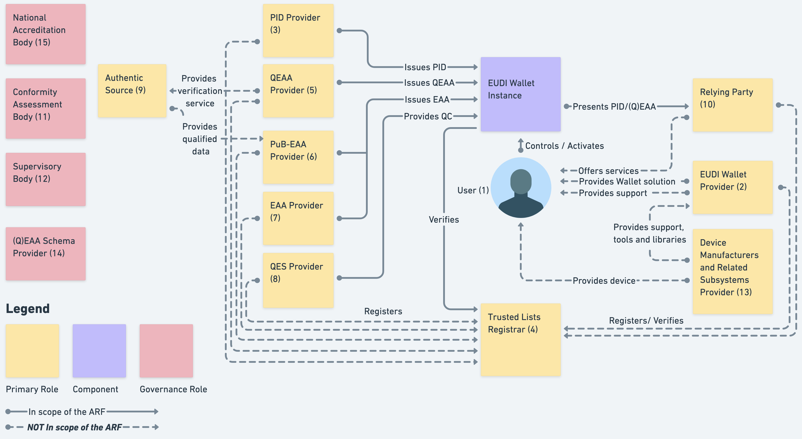
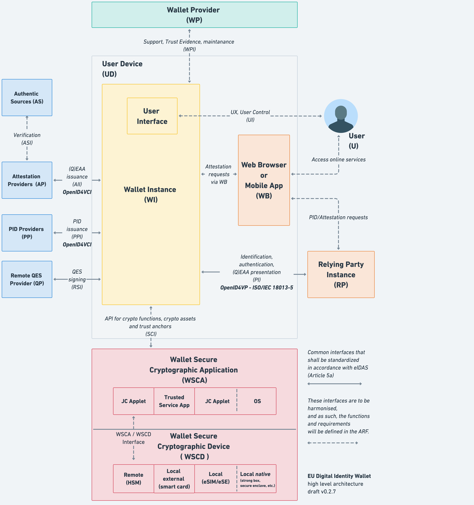
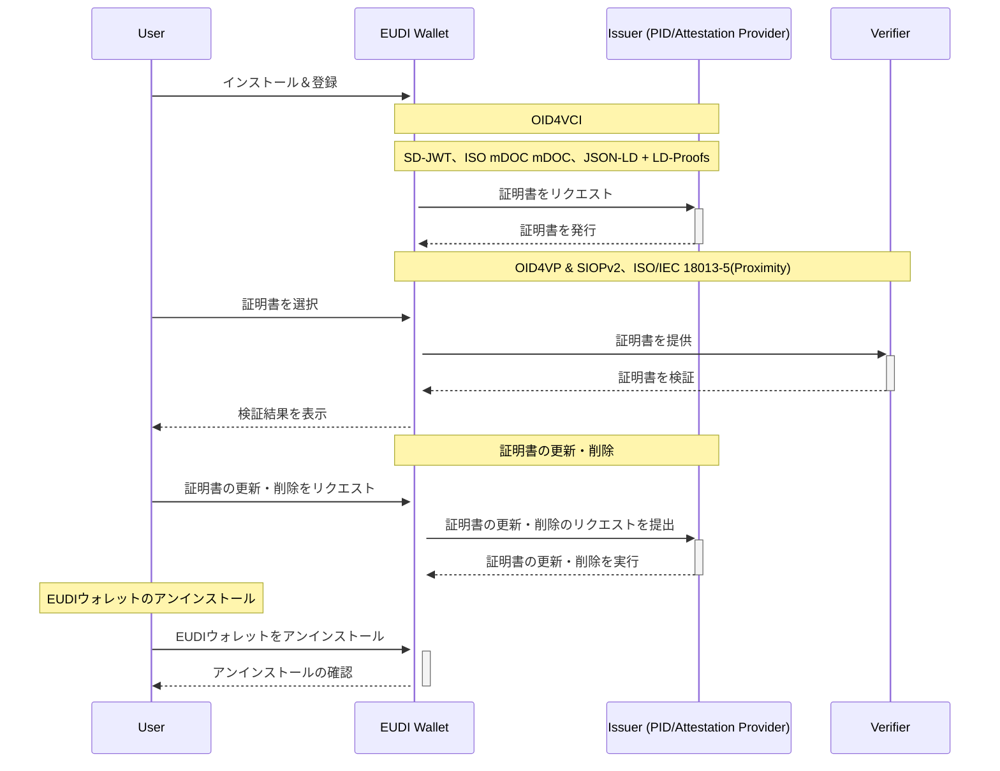
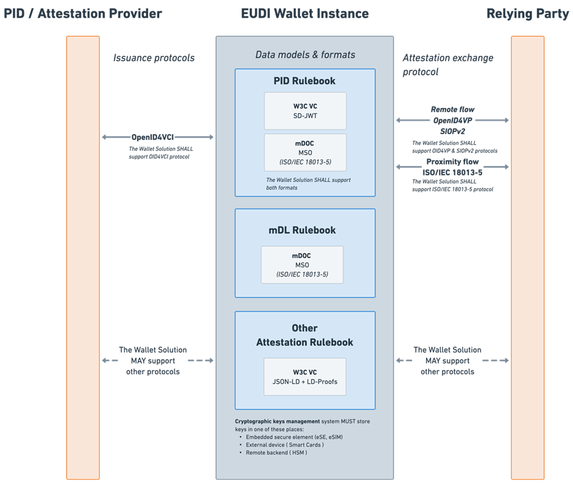
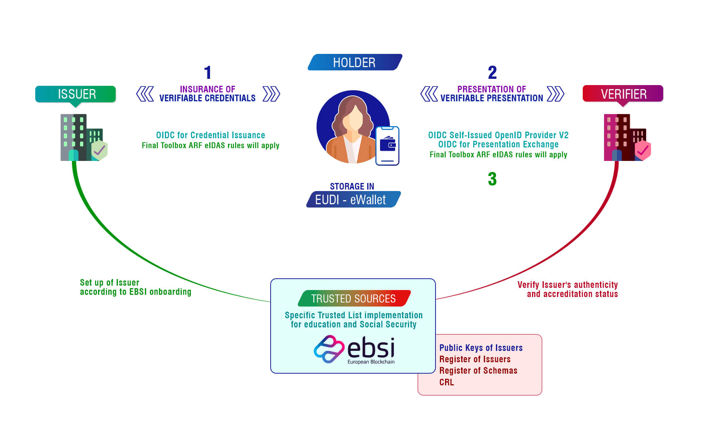
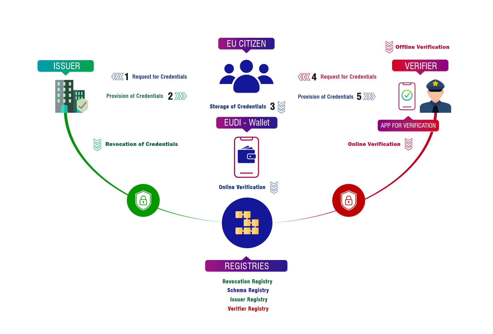

# EUDI Wallet に関するの調査

## 概要

- EUDI ウォレットは、eIDAS フレームワークの進化に基づいて設計されました。最初の eIDAS 規則は 2014 年に施行され、デジタル身分認証と信頼サービスに対する統一された EU の枠組みを提供することを目的としていました。2020 年、EU は eIDAS 規則の改訂（eIDAS 2）を進め、統一されたヨーロッパのデジタル ID インフラを構築することにしました。EUDI ウォレットは、この新しいインフラの中核要素として、すべての EU 市民がデジタル身分認証やさまざまなデジタルサービスへのアクセスを容易に行えるように、安全で便利なデジタル身分証明および文書管理ツールを提供することを目指しています。

## 開発言語

- Kotlin（Android）
- Swift（iOS）
- TypeScript（Web）
- Python（Backend）

## 基本機能

1. 身元確認
   - パブリックサービスへのアクセスや銀行口座の開設時に EUDI ウォレットを通じて自己の身元を確認できます。
2. 年齢確認
   - ソーシャルネットワークなどのプラットフォームにログインする際に、ユーザーが自分の年齢を証明できます。
3. 医療およびその他の重要なファイルの保管と表示
   - 医療処方箋、運転免許証、学位証明書などの重要文書を保管し、表示することができます。
4. 契約締結
   - ユーザーは EUDI ウォレットを使用してデジタル契約に署名できます。
5. 支払い認証
   - ユーザーが金融取引を行う際のデジタル的な支払い認証をサポートします。

## コアコンセプト

1. 個人身元データ（PID - Person Identification Data）
   - PID は、個人または法人の身元を確立するためのデータセットです。これには、個人を識別する情報、例えば氏名、生年月日、国籍などが含まれます。
2. デジタル属性証明（EAAs - Electronic Attestation of Attributes）
   - EAAs は、個人の様々な属性を検証するためのデジタル形式の証明です。例えば、医療処方箋、運転免許証、学位証明書などが EAAs として表示および検証されます。
3. 合格したデジタル属性証明（QEAA - Qualified Electronic Attestations of Attributes）
   - QEAAs は、特定の基準および法規要件を満たす EAAs で、合格した信頼サービスプロバイダーによって発行されます。これらの証明は個人または法人に関連付けられ、合格したデジタル署名またはデジタル印章で署名されます。

## eIDAS ARF(Architecture and Reference Framework) フレームワーク

1. [エコシステム](https://github.com/eu-digital-identity-wallet/eudi-doc-architecture-and-reference-framework/blob/main/docs/arf.md#3-ecosystem)
    
   
    
   - PID 提供者
     - ユーザーが EUDI ウォレットで身元を確認するための個人身元データ（PID）を発行します。PID とは、氏名や生年月日など、個人を特定するための基本情報です。
   - QEAA 提供者
     - 特定の基準と法規を満たす合格したデジタル属性証明（QEAA）を提供します。QEAA は、公的機関が認証した属性情報で、法的な証明力を持ちます。
   - EAA 提供者
     - ユーザーの異なる属性、例えば運転免許証や学位証明書などを検証するためのデジタル属性証明（EAA）を提供します。EAA は、個人の属性や資格をデジタル形式で証明します。
   - QES 提供者
     - 取引と文書の安全性と法的効力を保証するために、合格したデジタル署名サービスを提供します。QES は、電子署名の中でも特に高い信頼性と安全性を認証された署名です。
   - EUDI ウォレット提供者
     - ウォレットソリューションとサービスを提供し、ユーザーの日常使用と管理をサポートします。
   - 装置（オペレーティングシステム）製造業者
     - EUDI ウォレットアプリケーションをサポートする装置とオペレーティングシステムを提供します。
   - 検証者（Relying Party）
     - ユーザーが提供する PID/QEAA を検証する必要がある第三者、例えば銀行や政府機関です。
   - 信頼リスト提供者
     - すべての参加者とサービスが検証され信頼できることを保証する信頼リストを維持します。
2. 流れ
   1. [シーケンス図](https://github.com/eu-digital-identity-wallet/eudi-doc-architecture-and-reference-framework/blob/main/docs/arf.md#42-reference-architecture)
       
      
       
   2. 大まかな流れ
      - ユーザーは、自身のデバイス上の EUDI ウォレットインスタンスを通じてウォレット機能を制御および活性化します。
      - ウォレットは、複数の提供者との相互作用を通じて PID および各種証明を取得し検証します。
      - ユーザーは、これらの情報を依存者に提示してサービスを受けるか取引を行います。

## シーケンス図

## 自作ウォレットのサポート

- 開発者がサーバー、クライアント、モバイルアプリ向けに自作ウォレットを構築できるようサポートしています。
  - モバイルアプリ
    - Kotlin（Android）
    - Swift（iOS）
  - サーバー、クライアント
    - TypeScript/Node.js、Python、Kotlin

## サポートされているクレデンシャル形式

1. PID（Personal Identifiable Data）
   - SD-JWT (Selective Disclosure JWT)
   - ISO mDL
2. ISO mDL (Mobile Driving License)
   - ISO/IEC 18013-5
3. 上記以外
   - JSON-LD + LD-Proofs

 

- [参照リンク](https://github.com/eu-digital-identity-wallet/eudi-doc-architecture-and-reference-framework/blob/v1.3.0/docs/media/image7.png)

 

## サポートされている通信・認証プロトコル規格

### 通信プロトコル

1. ISO/IEC 18013-5(Proximity)
   - 近接通信に使用されます。例えば、ユーザーが警察官に運転免許証を示す必要がある場合、EUDI Wallet を使用してデジタル運転免許証を提供できます。ユーザーと警察官のデバイスが近接している状況で、必要なデータが安全に転送されます。
   - ライブラリ
     - [Android ISO 18013-5 Wallet Transfer library](https://github.com/eu-digital-identity-wallet/eudi-lib-android-iso18013-data-transfer)
     - [iOS ISO/IEC 18013-5 Wallet Data Transfer library](https://github.com/eu-digital-identity-wallet/eudi-lib-ios-iso18013-data-transfer)

### 認証プロトコル

1. OAuth 2.0
   - VC 発行に使用されます。発行する前にユーザーの同意と認可を確保します。
   - ライブラリ
     - [Android SIOPv2 and OpenID4VP library](https://github.com/eu-digital-identity-wallet/eudi-lib-jvm-siop-openid4vp-kt)
     - [iOS SIOPv2 and OpenID4VP library](https://github.com/eu-digital-identity-wallet/eudi-lib-ios-siop-openid4vp-swift)
2. OIDC (OpenID Connect)
   - VC 発行・検証時の身元確認に使用されます。
   - ライブラリ
     - OAuth 2.0 と同じ
3. SIOPv2(Self-Issued OpenID Provider v2)
   - VC 検証に使用されます。ユーザーが自己発行した証明書を検証者に提示し、検証者は SIOPv2 標準を通じて VC を検証します。
   - ライブラリ
     - OAuth 2.0 と同じ

### クレデンシャル交換プロトコル

1. OID4VCI (OpenID for Verifiable Credential Issuance)
   - VC を発行するために使用されます。発行者はユーザーに証明書を発行し、ユーザーはそれをウォレットに保存します。
   - ライブラリ
     - [Android OpenId4VCI library](https://github.com/eu-digital-identity-wallet/eudi-lib-jvm-openid4vci-kt)
     - [iOS OpenId4VCI library](https://github.com/eu-digital-identity-wallet/eudi-lib-ios-openid4vci-swift)
2. OID4VP (OpenID for Verifiable Presentations)
   - ユーザーが VC を提示し、検証者がその情報を検証する時に使用されます。ユーザーは証明書を検証者に提示し、検証者は OIDC4VP を通じて証明書を検証します。
   - ライブラリ
     - [Android SIOPv2 and OpenID4VP library](https://github.com/eu-digital-identity-wallet/eudi-lib-jvm-siop-openid4vp-kt)
     - [iOS SIOPv2 and OpenID4VP library](https://github.com/eu-digital-identity-wallet/eudi-lib-ios-siop-openid4vp-swift)
3. DIF Presentation Exchange Protocol
   - ユーザーは検証者の要求に基づいて関連する証明書を提示し、検証者はこの規格を通じてこれらの証明書を検証します。
   - ライブラリ
     - [Android Presentation Exchange library](https://github.com/eu-digital-identity-wallet/eudi-lib-jvm-presentation-exchange-kt)
     - [iOS Presentation Exchange library](https://github.com/eu-digital-identity-wallet/eudi-lib-ios-presentation-exchange-swift)
4. Presentation Exchange Protocol
   - ユーザーは検証者の要求に従って必要な証明書を提出し、検証者はこれらの証明書を検証します。
   - ライブラリ
     - DIF Presentation Exchange Protocol と同じ
5. Issue Credential Protocol
   - 発行者はこのプロトコルを通じてユーザーに証明書を発行し、ユーザーはそれをウォレットに保存します。
   - ライブラリ
     - OID4VCI と同じ
6. Present Proof Protocol
   - ユーザーは検証者に必要な証明書を提示し、検証者はこのプロトコルを使用して証明書を検証します。
   - ライブラリ
     - OID4VP、 DIF Presentation Exchange Protocol と同じ

## ライブラリ

1. Android
   - [Wallet Core library](https://github.com/eu-digital-identity-wallet/eudi-lib-android-wallet-core)
     - 基本的なウォレット機能とセキュリティ機能を提供します。例：クレデンシャル管理、認証
   - [ISO 18013-5 Wallet Transfer library](https://github.com/eu-digital-identity-wallet/eudi-lib-android-iso18013-data-transfer)
     - モバイル運転免許証のデータ転送をサポートします。例：運転免許証データの安全な転送
   - [Presentation Exchange library](https://github.com/eu-digital-identity-wallet/eudi-lib-jvm-presentation-exchange-kt)
     - 複数のプラットフォーム間での証明書交換を可能にします。例：デジタル身分証明書の共有
   - [SIOPv2 and OpenID4VP library](https://github.com/eu-digital-identity-wallet/eudi-lib-jvm-siop-openid4vp-kt)
     - OpenID Connect を用いた認証と検証プロセスを提供します。例：ユーザー認証とアイデンティティ検証
   - [SD-JWT library](https://github.com/eu-digital-identity-wallet/eudi-lib-jvm-sdjwt-kt)
     - 選択的開示を可能にする JWT をサポートします。
   - [OpenId4VCI library](https://github.com/eu-digital-identity-wallet/eudi-lib-jvm-openid4vci-kt)
     - 証明書発行のための OpenID Connect プロトコルを実装します。例：デジタル証明書の発行
   - [Wallet Documents Manager library](https://github.com/eu-digital-identity-wallet/eudi-lib-android-wallet-document-manager)
     - 文書管理と整理機能を提供します。例：デジタル文書の整理とアクセス
2. iOS
   - [Wallet Kit library](https://github.com/eu-digital-identity-wallet/eudi-lib-ios-wallet-kit)
     - 基本的なウォレット機能とセキュリティ機能を提供します。
   - [ISO/IEC 18013-5 Security library](https://github.com/eu-digital-identity-wallet/eudi-lib-ios-iso18013-security)
     - モバイル運転免許証のセキュリティ機能を強化するためのライブラリです。例：データ保護と暗号化
   - [ISO/IEC 18013-5 Wallet Data Transfer library](https://github.com/eu-digital-identity-wallet/eudi-lib-ios-iso18013-data-transfer)
     - モバイルデバイス間で安全にデータを転送する機能をサポートします。例：データ交換
   - [ISO/IEC 18013-5 Wallet Data Model library](https://github.com/eu-digital-identity-wallet/eudi-lib-ios-iso18013-data-model)
     - モバイル運転免許証のデータモデリングをサポートします。例：デジタル運転免許証のデータ構造定義
   - [Presentation Exchange library](https://github.com/eu-digital-identity-wallet/eudi-lib-ios-presentation-exchange-swift)
     - 複数のプラットフォーム間での証明書交換を可能にします。
   - [SIOPv2 and OpenID4VP library](https://github.com/eu-digital-identity-wallet/eudi-lib-ios-siop-openid4vp-swift)
     - OpenID Connect を用いた認証と検証プロセスを提供します。例：オンライン認証
   - [SD-JWT library](https://github.com/eu-digital-identity-wallet/eudi-lib-sdjwt-swift)
     - 選択的開示を可能にする JWT をサポートします。
   - [OpenId4VCI library](https://github.com/eu-digital-identity-wallet/eudi-lib-ios-openid4vci-swift)
     - 証明書発行のための OpenID Connect プロトコルを実装します。
   - [Wallet Storage library](https://github.com/eu-digital-identity-wallet/eudi-lib-ios-wallet-storage)
     - データ管理とアクセス制御機能を提供します。例：データの保管

## [パイロットプロジェクト](https://ec.europa.eu/digital-building-blocks/sites/display/EUDIGITALIDENTITYWALLET/What+are+the+Large+Scale+Pilot+Projects)

1. [Potential (Pilots for European Digital Identity Wallet)](https://www.digital-identity-wallet.eu/)
   - 公共サービスのデジタル化とセクター間協力を推進。
2. [EWC (EU Digital Wallet Consortium)](https://eudiwalletconsortium.org/)
   - デジタル旅行証明の使用事例に注力。
3. [DC4EU (Digital Credentials for Europe)](https://www.dc4eu.eu/)
   - 教育と社会保障のデジタルサービスを支援。
      
     
      
     
      
4. [NOBID Consortium](https://www.nobidconsortium.com/)
   - 北欧およびバルト諸国での製品やサービスの支払い承認を試験。

## コミュニティの活動状況

- EUDI Wallet は、European Digital Identity プロジェクトの一部として、欧州連合（EU）のデジタル戦略の推進に貢献するオープンソースプロジェクトです。このプロジェクトには 360 の民間企業や公共機関が参加しており、EU 全域でデジタルアイデンティティウォレットの展開と統合を支援しています。また、GitHub での活動を見ると、EUDI Wallet のリポジトリは 331 のスターと 42 のフォークが寄せられ、プロジェクトへの広範な関心と活発な参加が示されています。また、46 件のオープンイシューと 7 件のプルリクエストが進行中であり、これらの数字から EUDI Wallet コミュニティの活動が非常に活発であることが示されています。

## サンプル

- Wallet(Holder)

  - [Android Demo](https://github.com/eu-digital-identity-wallet/eudi-app-android-wallet-ui)
    1. 前提条件
       - [Kotlin/Android 環境構築](https://kotlin.keicode.com/devenv/)
    2. 主なライブラリ
       - [Wallet Core library](https://github.com/eu-digital-identity-wallet/eudi-lib-android-wallet-core)
       - [ISO 18013-5 Wallet Transfer library](https://github.com/eu-digital-identity-wallet/eudi-lib-android-iso18013-data-transfer)
       - [Presentation Exchange library](https://github.com/eu-digital-identity-wallet/eudi-lib-jvm-presentation-exchange-kt)
       - [SIOPv2 and OpenID4VP library](https://github.com/eu-digital-identity-wallet/eudi-lib-jvm-siop-openid4vp-kt)
       - [SD-JWT library](https://github.com/eu-digital-identity-wallet/eudi-lib-jvm-sdjwt-kt)
       - [OpenId4VCI library](https://github.com/eu-digital-identity-wallet/eudi-lib-jvm-openid4vci-kt)
       - [Wallet Documents Manager library](https://github.com/eu-digital-identity-wallet/eudi-lib-android-wallet-document-manager)
    3. [実現された機能](https://github.com/eu-digital-identity-wallet/eudi-app-android-wallet-ui/tree/main?tab=readme-ov-file#overview)
    4. 操作手順
       - [Demo Download](<https://install.appcenter.ms/orgs/eu-digital-identity-wallet/apps/eudi-reference-android/distribution_groups/eudi%20wallet%20(demo)%20public>) または　[ローカル構築](https://github.com/eu-digital-identity-wallet/eudi-app-android-wallet-ui?tab=readme-ov-file#how-to-use-the-application)
       - [実行手順](https://github.com/eu-digital-identity-wallet/eudi-app-android-wallet-ui?tab=readme-ov-file#demo-videos)
       - [設定情報の確認](https://github.com/eu-digital-identity-wallet/eudi-app-android-wallet-ui/blob/main/wiki/configuration.md)
  - [iOS Demo](https://github.com/eu-digital-identity-wallet/eudi-app-ios-wallet-ui)
    1. 前提条件
       - Xcode の用意
    2. 主なライブラリ
       - [Wallet Kit library](https://github.com/eu-digital-identity-wallet/eudi-lib-ios-wallet-kit)
       - [ISO/IEC 18013-5 Security library](https://github.com/eu-digital-identity-wallet/eudi-lib-ios-iso18013-security)
       - [ISO/IEC 18013-5 Wallet Data Transfer library](https://github.com/eu-digital-identity-wallet/eudi-lib-ios-iso18013-data-transfer)
       - [ISO/IEC 18013-5 Wallet Data Model library](https://github.com/eu-digital-identity-wallet/eudi-lib-ios-iso18013-data-model)
       - [Presentation Exchange library](https://github.com/eu-digital-identity-wallet/eudi-lib-ios-presentation-exchange-swift)
       - [SIOPv2 and OpenID4VP library](https://github.com/eu-digital-identity-wallet/eudi-lib-ios-siop-openid4vp-swift)
       - [OpenId4VCI library](https://github.com/eu-digital-identity-wallet/eudi-lib-ios-openid4vci-swift)
       - [Wallet Storage library](https://github.com/eu-digital-identity-wallet/eudi-lib-ios-wallet-storage)
    3. [実現された機能](https://github.com/eu-digital-identity-wallet/eudi-app-ios-wallet-ui?tab=readme-ov-file#overview)
    4. 操作手順
       - [実行手順](https://github.com/eu-digital-identity-wallet/eudi-app-ios-wallet-ui/blob/main/README.md#how-to-use-the-application)
       - [設定情報の確認](https://github.com/eu-digital-identity-wallet/eudi-app-ios-wallet-ui/blob/main/wiki/configuration.md)

- Issuer
  1. [Python Demo](https://github.com/eu-digital-identity-wallet/eudi-srv-web-issuing-eudiw-py)
     1. [実現された機能](https://github.com/eu-digital-identity-wallet/eudi-srv-web-issuing-eudiw-py?tab=readme-ov-file#eudiw-issuer)
     2. 操作手順
        1. [Online 操作](https://issuer.eudiw.dev/)
        2. ローカル構築
           1. 前提条件
              - [環境構築](https://github.com/eu-digital-identity-wallet/eudi-srv-web-issuing-eudiw-py/blob/main/install.md)
           2. [実行手順](https://github.com/eu-digital-identity-wallet/eudi-srv-web-issuing-eudiw-py?tab=readme-ov-file#2-run)
  2. [Kotlin Demo](https://github.com/eu-digital-identity-wallet/eudi-srv-pid-issuer)
     1. [実現された機能](https://github.com/eu-digital-identity-wallet/eudi-srv-pid-issuer?tab=readme-ov-file#overview)
     2. 操作手順
        1. [Online 操作](https://issuer-backend.eudiw.dev/)
        2. ローカル構築
           1. 前提条件
              - [Kotlin 環境構築](https://kotlin.keicode.com/devenv/)
           2. 手順
              - [Docker コンテイナーの設定](https://github.com/eu-digital-identity-wallet/eudi-srv-pid-issuer?tab=readme-ov-file#how-to-use-docker)
              - [設定情報の確認](https://github.com/eu-digital-identity-wallet/eudi-srv-pid-issuer?tab=readme-ov-file#configuration)
              - [使用方法](https://github.com/eu-digital-identity-wallet/eudi-srv-pid-issuer?tab=readme-ov-file#endpoints)
- Verifier
  1. [Frontend](https://github.com/eu-digital-identity-wallet/eudi-web-verifier)
     1. [Online 操作](https://verifier.eudiw.dev)
     2. ローカル構築
        1. 前提条件
           - Node.JS をインストールされたこと
        2. 手順
           - パッケージのインストール
           - [使用方法](https://github.com/eu-digital-identity-wallet/eudi-web-verifier/blob/main/package.json)
  2. [Backend Restful service](https://github.com/eu-digital-identity-wallet/eudi-srv-web-verifier-endpoint-23220-4-kt)
     1. [実現された機能](https://github.com/eu-digital-identity-wallet/eudi-srv-web-verifier-endpoint-23220-4-kt?tab=readme-ov-file#overview)
     2. 操作手順
        1. 前提条件
           - [Kotlin 環境構築](https://kotlin.keicode.com/devenv/)
        2. [使用方法](https://github.com/eu-digital-identity-wallet/eudi-srv-web-verifier-endpoint-23220-4-kt?tab=readme-ov-file#how-to-use)

## 参考文献

- [reference-implementation](https://github.com/eu-digital-identity-wallet/.github/blob/main/profile/reference-implementation.md)
- [ARF(Architecture and Reference Framework)](https://github.com/eu-digital-identity-wallet/eudi-doc-architecture-and-reference-framework/blob/main/docs/arf.md)
- [EUDI HOME](https://ec.europa.eu/digital-building-blocks/sites/display/EUDIGITALIDENTITYWALLET/EU+Digital+Identity+Wallet+Home)
