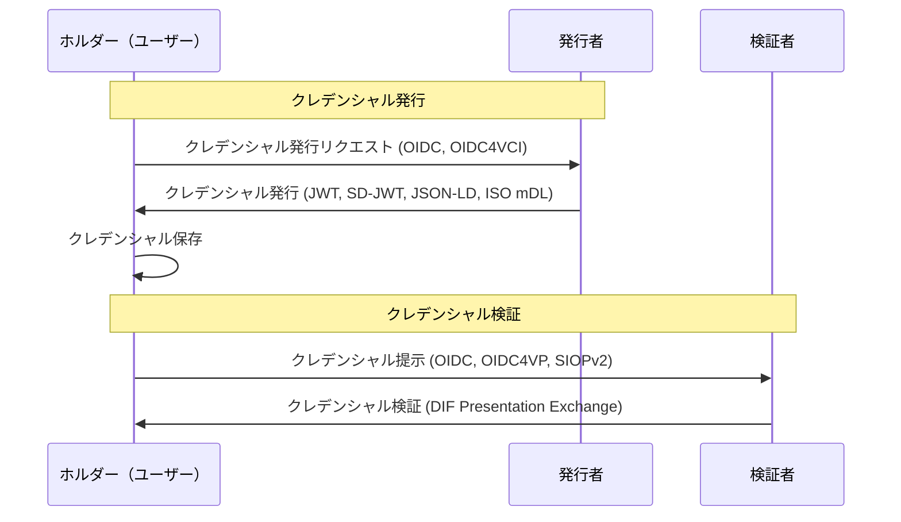
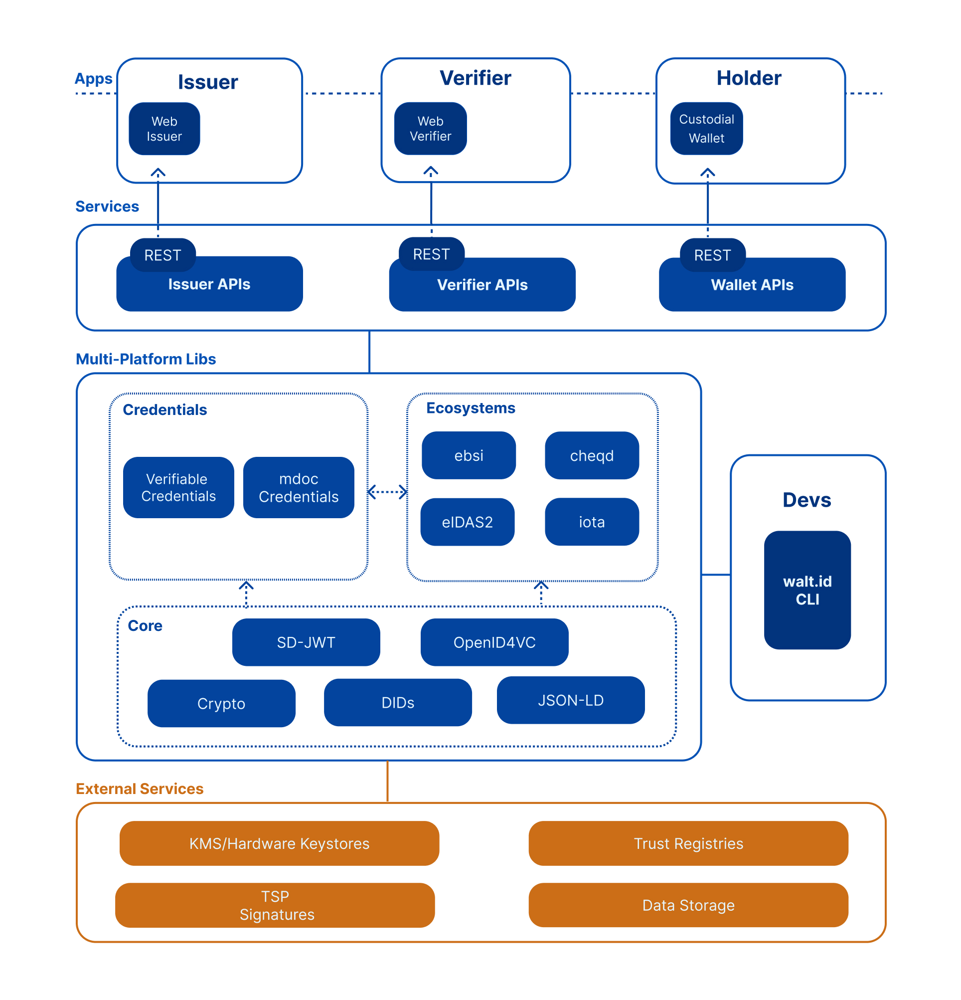

# OID4VC に関するの調査

## 概要

- OID4VC（OpenID for Verifiable Credentials）は、OpenID Connect の拡張であり、検証可能なクレデンシャルの発行および提示を可能にするための仕様です。OID4VC は、デジタルアイデンティティの信頼性を高めるために設計されており、ユーザーが自分のデジタル資格情報を安全に共有できるようにすることを目的としています。

## 主要な仕様

1. [OpenID for Verifiable Credential Issuance (OID4VCI)](https://openid.net/specs/openid-4-verifiable-credential-issuance-1_0.html)
   - OAuth 2.0 Authorization Code Flow を拡張し、発行者がクレデンシャルを安全に提供するためのプロトコルを定義しています。
2. [OpenID for Verifiable Presentations (OID4VP)](https://openid.net/specs/openid-4-verifiable-presentations-1_0.html)
   - 発行されたクレデンシャルを第三者に安全に提示するための標準化された方法を提供します。OAuth 2.0 認証を基にして、ユーザーが検証者に対してクレデンシャルを提示できるようにします。
3. [Self-Issued OpenID Provider v2 (SIOPv2)](https://openid.net/specs/openid-connect-self-issued-v2-1_0.html)
   - ユーザーが管理する OpenID Provider (OP) を使用することを可能にし、自身のクレデンシャルを発行および管理する方法を定義します。
4. [OpenID for Verifiable Presentations over BLE (Bluetooth Low Energy)](https://openid.net/specs/openid-4-verifiable-presentations-over-ble-1_0.html)
   - BLE を通じて検証可能なプレゼンテーションを提供するための仕様です。これにより、デバイス間でのデータ交換が可能になります。
5. [OpenID Connect UserInfo Verifiable Credentials](https://openid.net/specs/openid-connect-userinfo-vc-1_0-00.html)
   - OpenID Connect UserInfo Endpoint から現在提供されているユーザ属性を、検証可能なクレデンシャルとして発行できるようにする。
6. [OpenID4VC High Assurance Interoperability Profile with SD-JWT VC](https://openid.net/specs/openid4vc-high-assurance-interoperability-profile-sd-jwt-vc-1_0.html)
   - SD-JWT(Selective Disclosure JWT)を使用して、クレデンシャルの発行と提示におけるセキュリティを強化します。

## サポートされているクレデンシャル形式

1. JWT (JSON Web Tokens)
   - クレデンシャルの発行と検証を行うための標準的なフォーマットです。
2. SD-JWT (Selective Disclosure JWT)
   - 選択的開示 (Selective Disclosure) を実現するためのフォーマットです。
3. JSON-LD (JSON for Linking Data)
   - W3C が定義したデータ表現形式であり、検証可能なクレデンシャルのデータを構造化し、セマンティックな相互運用性を提供します。
4. LDP (Linked Data Proofs)
   - 検証可能なクレデンシャルのためのセキュアな証明方法を提供し、データの整合性と信頼性を確保します。
5. ISO mDL (Mobile Driving License)
   - ISO によって定義されたモバイル運転免許証のフォーマットで、デジタル運転免許証の発行と検証に使用されます。

## サポートされている通信・認証プロトコル規格

### 通信プロトコル

1. DIDComm
   - 分散型アイデンティティ用のメッセージングプロトコルで、クレデンシャルの発行および提示のための通信に使用されます。
2. DidExchange Protocol
   - DDID ベースのピア間でのコネクションを確立するためのプロトコルです。これにより、セキュアな通信チャネルを設定してクレデンシャルの交換を行います。
3. Connections Protocol
   - 分散型アイデンティティフレームワーク内で使用されるプロトコルで、エージェント間のコネクションを確立し、メッセージのやり取りを行います。
4. BLE (Bluetooth Low Energy)
   - デバイス間でのクレデンシャルの伝送を可能にします。

### 認証プロトコル

1. OAuth 2.0
   - クレデンシャルの発行と提示において、認証および認可のフレームワークとして使用されます。
2. OIDC (OpenID Connect)
   - OAuth 2.0 を基にした認証プロトコルで、ユーザーのアイデンティティを検証します。
3. SIOPv2(Self-Issued OpenID Provider v2)
   - ユーザーが自己発行の OpenID プロバイダーとして機能するためのプロトコルで、自己主権型のアイデンティティ管理を実現します。

### クレデンシャル交換プロトコル

1. OIDC4VCI (OpenID Connect for Verifiable Credential Issuance)
   - 検証可能なクレデンシャルを発行するためのプロトコルです。
2. OIDC4VP (OpenID Connect for Verifiable Presentations)
   - 検証可能なクレデンシャルを提示するためのプロトコルです。
3. DIF Presentation Exchange Protocol
   - DIF が定義するプロトコルで、クレデンシャルの提示に関する標準化された方法を提供します。
4. Presentation Exchange Protocol
   - DIF によって提供されるプロトコルで、検証可能なクレデンシャルの提示を安全に交換するための標準です。
5. Issue Credential Protocol
   - クレデンシャルの発行を行うためのプロトコルです。
6. Present Proof Protocol
   - 検証可能なクレデンシャルの証明を提示するためのプロトコルです。

## シーケンス図

## ライブラリ

1. walt.id ([Docs](https://docs.walt.id/) | [GitHub](https://github.com/walt-id/waltid-identity))
   - 概要
     - 分散型アイデンティティ（DID）および検証可能なクレデンシャル（VC）に対応したオープンソースのアイデンティティソリューションを提供するプラットフォームです。主要機能にはクレデンシャルの発行、検証、保存などが含まれます。
        
       
        
   - サポートされている開発言語
     - Kotlin/Java、JavaScript
   - Swagger APIs
     - [Issuer](https://issuer.portal.walt.id/swagger/index.html)
     - [Verifier](https://verifier.portal.walt.id/swagger/index.html)
     - [Wallet(Holder)](https://wallet.walt.id/swagger/index.html)
2. [Sphereon](https://github.com/Sphereon-Opensource/)
   - 概要
     - SSI（Self-Sovereign Identity）ソリューションを提供するオープンソースプロジェクトで、特に DID および検証可能なクレデンシャルの発行と検証をサポートしています。
   - サポートされている開発言語
     - TypeScript/JavaScript、React-Native
   - 主なライブラリ
     - [SSI SDK](https://github.com/Sphereon-Opensource/ssi-sdk)
       - Presentation Exchange と OpenID4VC（SIOPv2、OID4VCI、OID4VP）およびその他の機能をサポートするパッケージ。また、DID メソッドおよび BBS+、RSA キーのサポートも提供しています。さらに、[Veramo](https://veramo.io/)と互換性があります。
     - [Client and Issuer](https://github.com/Sphereon-Opensource/OID4VCI)
       - クレデンシャル発行およびクライアント向けの機能を提供。
     - [SIOP-OID4VP](https://github.com/Sphereon-Opensource/SIOP-OID4VP)
       - クレデンシャル提示のためのプロトコルを提供。
3. [Microsoft Verifiable Credential Service](https://github.com/microsoft/Decentralized-Identity-and-Verifiable-Credentials)
   - 概要
     - 分散型アイデンティティと検証可能なクレデンシャルの管理をサポートするライブラリとツールを提供しています。主にエンタープライズ向けに設計されています。
   - 主なライブラリ
     - [android-wallet-library](https://github.com/microsoft/entra-verifiedid-wallet-library-android)
       - Android デバイス向けのウォレットライブラリ。開発言語は Kotlin。
     - [ios-wallet-library](https://github.com/microsoft/entra-verifiedid-wallet-library-ios)
       - iOS デバイス向けのウォレットライブラリ。開発言語は Swift。

## 参考文献

1. [OID4VC](https://openid.net/sg/openid4vc/)
2. [OID4VC Whitepaper](https://openid.net/wordpress-content/uploads/2022/05/OIDF-Whitepaper_OpenID-for-Verifiable-Credentials_FINAL_2022-05-12.pdf)
