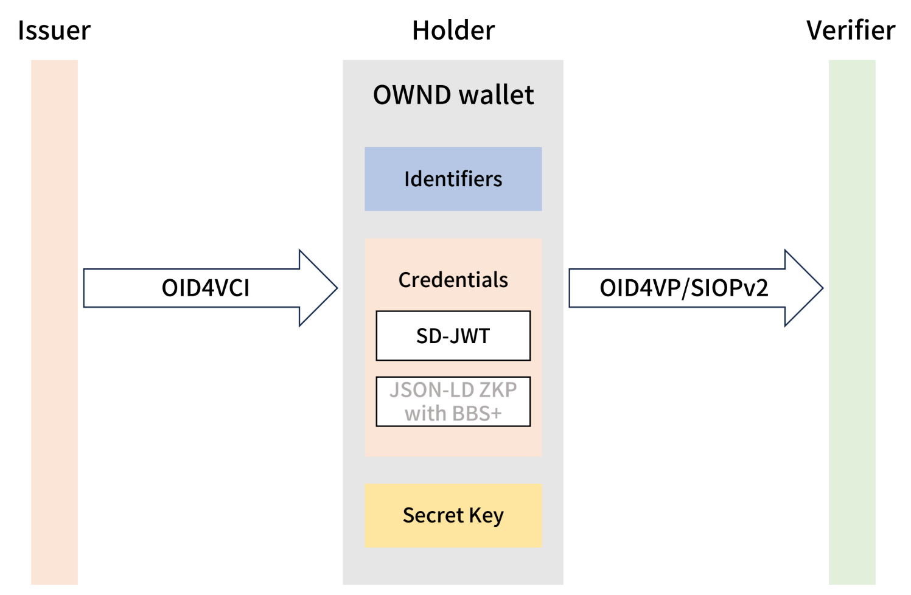
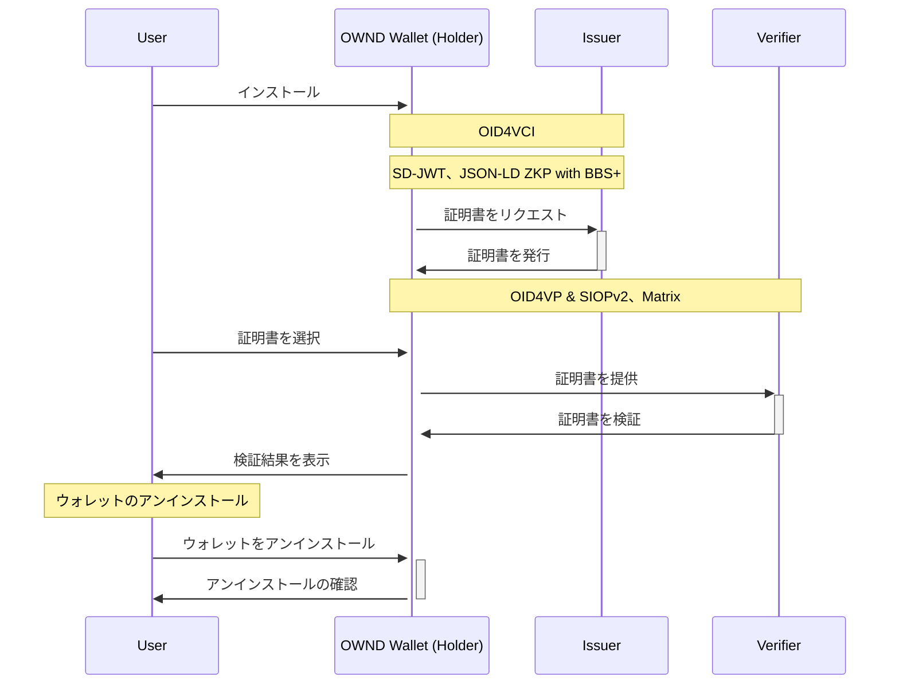

# OWND Wallet に関するの調査

## 概要

- OWND Project は、個人主導のデジタルアイデンティティを実現するための非営利オープンソースプロジェクトです。これは日本政府の「Trusted Web」計画の一部で、安全で信頼性の高い通信を目指しています。
  - 開発物（予定）
    - OpenID for Verifiable Credential Issuance（OID4VCI）の Holder,Issuer 実装
    - OpenID for Verifiable Presentations（OID4VP）の Holder,Verifier 実装
    - Self-Issued OpenID Provider v2（SIOPv2）の Holder,Verifier 実装
    - Selective Disclosure for JWTs（SD-JWT）証明書
    - JSON-LD ZKP with BBS+ 証明書

## 開発言語

- Kotlin（Android）
- Swift（iOS）
- TypeScript（Frontend）
- Python（Backend）

## 自作ウォレットのサポート

- 開発者がサーバー、クライアント、モバイルアプリ向けに自作ウォレットを構築できるようサポートしています。
  - モバイルアプリ
    - Kotlin（Android）
    - Swift（iOS）
  - サーバー、クライアント
    - TypeScript/Node.js、Python

## サポートされているクレデンシャル形式

1. SD-JWT (Selective Disclosure JWT)
2. JSON-LD ZKP with BBS+

 

- [参照リンク](https://raw.githubusercontent.com/OWND-Project/.github/main/media/ownd-wallet.png)
   

## サポートされている通信・認証プロトコル規格

### 通信プロトコル

1. Matrix
   - 分散型通信標準で、チャット、音声、ビデオ通話などのインスタントメッセージング機能をサポートしています。これにより、異なるサーバー間のユーザーがシームレスに通信できる通信ネットワークが構築されます。
   - ライブラリ
     - [OWND-Messenger-React-SDK](https://github.com/OWND-Project/OWND-Messenger-React-SDK)
     - [OWND-Messenger-Client](https://github.com/OWND-Project/OWND-Messenger-Client)
     - [OWND-Messenger-Server](https://github.com/OWND-Project/OWND-Messenger-Server)

### 認証プロトコル

1. SIOPv2
   - VC 検証に使用されます。ユーザーが自己発行した証明書を検証者に提示し、検証者は SIOPv2 標準を通じて VC を検証します。
   - ライブラリ
     - [OWND-Messenger-React-SDK](https://github.com/OWND-Project/OWND-Messenger-React-SDK)
     - [OWND-Messenger-Client](https://github.com/OWND-Project/OWND-Messenger-Client)
     - [OWND-Messenger-Server](https://github.com/OWND-Project/OWND-Messenger-Server)
2. OIDC (OpenID Connect)
   - VC 発行・検証時の身元確認に使用されます。
   - ライブラリ
     - SIOPv2 と同じ

### クレデンシャル交換プロトコル

1. OID4VCI
   - VC の発行をサポートします。
   - ライブラリ
     - [OWND-Project-VCI](https://github.com/OWND-Project/OWND-Project-VCI)
2. OID4VP
   - 提示されたクレデンシャルの検証をサポートします。
   - ライブラリ
     - SIOPv2 と同じ

## ライブラリ

1. Android
   - [OWND-Wallet-Android](https://github.com/OWND-Project/OWND-Wallet-Android)
     - 基本的なウォレット機能とセキュリティ機能を提供します。例：デジタル ID を管理
2. iOS
   - [OWND-Wallet-iOS](https://github.com/OWND-Project/OWND-Wallet-iOS)
     - OWND-Wallet-Android と同じ
3. [OWND-Project-VCI](https://github.com/OWND-Project/OWND-Project-VCI)
   - VC の発行と管理をサポートするライブラリ。
4. [OWND-Messenger-React-SDK](https://github.com/OWND-Project/OWND-Messenger-React-SDK)
   - React ベースのメッセージングアプリ開発キット、E2E 暗号化をサポート。
5. [OWND-Messenger-Client](https://github.com/OWND-Project/OWND-Messenger-Client)
   - メッセンジャークライアント、通信とデータ保管を提供。
6. [OWND-Messenger-Server](https://github.com/OWND-Project/OWND-Messenger-Server)
   - メッセージングサーバー、通信とデータ保管を提供。

## シーケンス図

## コミュニティの活動状況

- GitHub 上でフロントエンド、バックエンドとモバイルのリソースが提供されていますが、Star 数や Fork 数、Issue の活動とプルリクエストの件数が少ないことから、このプロジェクトはまだ新しく、広く認知されていない可能性が高いです。これにより、コミュニティの活動度は低いと考えられます。

## サンプル

1. Holder
   - [Android Demo](https://github.com/OWND-Project/OWND-Wallet-Android)
     1. 前提条件
        - [Kotlin/Android 環境構築](https://kotlin.keicode.com/devenv/)
     2. [実現された機能](https://github.com/OWND-Project/OWND-Wallet-Android?tab=readme-ov-file#features)
     3. 操作手順
        - [Demo Download](https://www.ownd-project.com/) または　[ローカル構築](https://github.com/OWND-Project/OWND-Wallet-Android?tab=readme-ov-file#installation-and-building)
   - [iOS Demo](https://github.com/OWND-Project/OWND-Wallet-iOS)
     1. 前提条件
        - Xcode の用意
     2. [実現された機能](https://github.com/OWND-Project/OWND-Wallet-iOS?tab=readme-ov-file#features)
     3. 操作手順
        - [Demo Download](https://www.ownd-project.com/) または　[ローカル構築](https://github.com/OWND-Project/OWND-Wallet-iOS?tab=readme-ov-file#installation-and-building)
2. [Issuer](https://github.com/OWND-Project/OWND-Project-VCI)
   1. 前提条件
      - Node.JS をインストールされたこと
   2. [実現された機能](https://github.com/OWND-Project/OWND-Project-VCI?tab=readme-ov-file#features)
   3. [操作手順](https://github.com/OWND-Project/OWND-Project-VCI?tab=readme-ov-file#installation)
3. Verifier
   1. [Frontend](https://github.com/OWND-Project/OWND-Messenger-Client)
      1. 前提条件
         - Node.JS をインストールされたこと
      2. [操作手順](https://github.com/OWND-Project/OWND-Messenger-Client?tab=readme-ov-file#setting-up-a-dev-environment)
   2. [Backend ](https://github.com/OWND-Project/OWND-Messenger-Server)
      1. [前提条件](https://github.com/OWND-Project/OWND-Messenger-Server?tab=readme-ov-file#prerequirement)
      2. [操作手順](https://github.com/OWND-Project/OWND-Messenger-Server?tab=readme-ov-file#install)

## 参考文献

- [OWND Wallet GitHub](https://github.com/OWND-Project/)
- [OWND Wallet Doc](https://www.ownd-project.com/)
