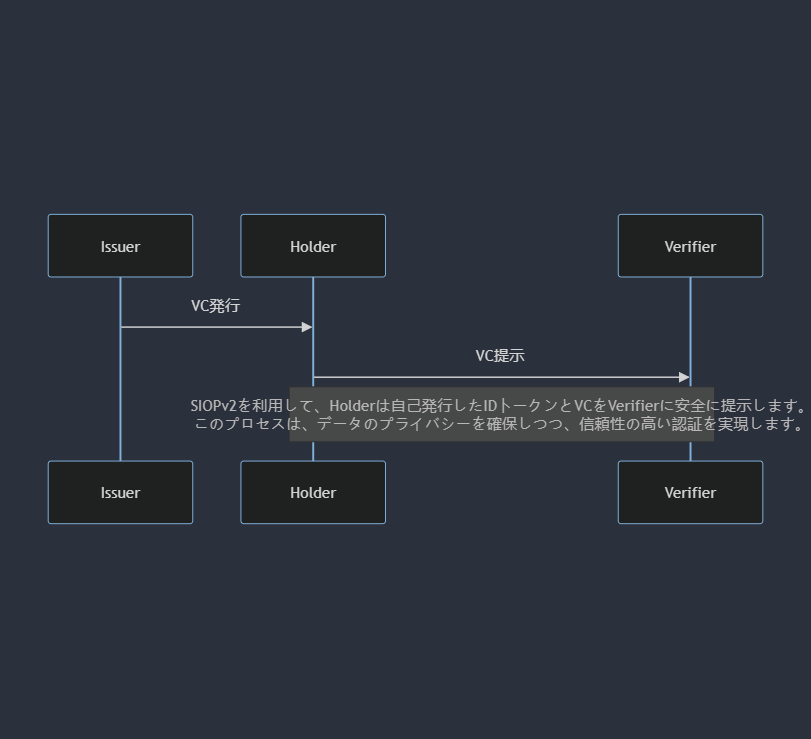
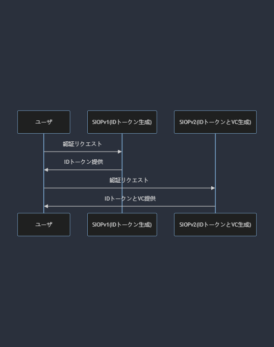

## SIOPv2 に関するの調査

### SIOPv2 (Self-Issued OpenID Provider)とは

- [SIOPv2](https://openid.github.io/SIOPv2/openid-connect-self-issued-v2-wg-draft.html)は OpenID Foundation が策定を進めている仕様で、OpenID Connect を拡張し、エンドユーザ自身が ID トークンを発行できるようにするための仕様です。以前の仕様（v2 が付かない SIOP）は[OpenID Connect Core 1.0](https://openid.net/specs/openid-connect-core-1_0.html)の仕様の一部でしたが、現在、SIOPv2 という独立した仕様として標準化作業が進められています。
- OpenID Connect では、OpenID Provider（OP）がエンドユーザの身元を証明する ID トークンを発行し、エンドユーザを認証したい第三者（Relying Party（RP））に提示します。その利用方法の代表例は、Web サービスを利用する際のソーシャルログイン（Google や Apple などのアカウントでログイン）です。このとき、Google や Apple などが OP となり、Web サービスが RP となります。SIOP は、この OP の役割をエンドユーザ自身が担い、自らの ID トークンを発行する仕組みです。
- SIOP のメリットは、巨大プラットフォームによる中央集権的な ID 管理から離れ、エンドユーザ自身が ID 管理を行える点にあります。ソーシャルログインを使用すれば、どの RP を使用したかの情報が OP に収集されます。また、OP のアカウントが停止されてしまえば、RP の利用もできなくなります。こういった中央集権的な ID 管理の弊害を克服するため、SSI （Self-Soverign Identity、自己主権型アイデンティティ）という考え方が普及し始めています。SIOP は OpenID Connect を SSI に対応させるための仕様です。

### 技術用語の説明

- `OpenID Provider（OP）`: ユーザーの身元を証明する ID トークンを発行するシステム。
- `Relying Party（RP）`: ID トークンを用いてユーザーを認証したいサービスやアプリケーション。
- `Self-Sovereign Identity（SSI）`: ユーザーが自らのアイデンティティ情報を完全に管理し、中央集権的な機関に依存しないアイデンティティ管理の概念。

### SIOPv1 と SIOPv2 の違い

1. SIOPv1
   - 主に openid://スキーマを利用してデバイス内で ID プロバイダー機能を持ちます。
   - ユーザーが署名鍵を信頼し、提供される情報は基本的に自己申告です。
2. SIOPv2
   - `https://`を含めたスキームをサポートし、より広範なアプリケーションと連携可能。
   - DID（Decentralized Identifier） を使用できるようになります。これにより、外部の検証可能データレジストリ（Verifiable Data Registry）が使用できるようになります。
   - OID4VP と組み合わせて、VC を ID トークンと共に提示できるようになります。RP は VC を検証することで、信頼できる発行者が発行した VC と ID トークンを紐付けることができるようになります。VC の検証処理は RP 側で完結しますので、VC の発行者に情報が収集されるということもありません。
      
     
      

 

 

### SIOPv2 プロトコル

- SIOPv2 のプロトコルでは 2 つのフローを定義しています。
  1. `Same-Device Self-Issued OP`: RP のクライアントアプリケーションと OP が同一端末で動作するフローです。RP と OP 間の連携にリダイレクトを使用します。
      
     
      
     1. `ユーザーがアプリを開始`: ユーザーが自身のデバイス上でアプリケーションを起動します。
     2. `アプリが認証リクエストを生成`: アプリケーションは OpenID Provider として機能し、認証リクエストを生成します。
     3. `ユーザーが認証を承認`: アプリケーションはユーザーに ID トークンの発行を求めるメッセージを表示し、ユーザーがこれを承認します。
     4. `デバイスがIDトークンを生成して提供`: ユーザーの承認を受けて、デバイスは ID トークンを生成し、アプリケーションに提供します。
     5. `アプリがIDトークンを使用してユーザーを認証`: アプリケーションは提供された ID トークンを用いてユーザーの身元を認証し、サービスへのアクセスを許可します。
  2. `Cross-Device Self-Issued OP`: OP が別デバイス（通常、スマートフォン）で動作するフローです。
      
     
      
     1. `ユーザが検証者 (Relying Party) にアクセス`：ユーザが検証者のサイトにアクセスし、認証プロセスを開始します。
     2. `検証者が自己発行リクエストURIを含むQRコードを表示`：検証者は、ユーザのデバイスが読み取り可能な QR コードを画面に表示します。この QR コードには自己発行リクエスト URI が含まれており、ユーザのスマートフォンで読み取ることが想定されています。
     3. `ユーザがQRコードをスキャン`：ユーザはスマートフォンを使用して QR コードをスキャンします。
        ディープリンクを通じて OpenID Provider (OP) を起動：スキャンした結果得られるディープリンクを通じて、スマートフォン上の OP アプリケーションが起動します。
     4. `OPがIDトークン発行の承認をユーザに求める`：OP はユーザに対して ID トークンを発行するための承認を求めます。
        ユーザが承認：ユーザが ID トークンの発行を承認します。
     5. `OPがIDトークンを検証者に送信`：承認された後、OP は生成された ID トークンを検証者のサーバーに直接送信します。
     6. `検証者が認証を完了`：検証者は受け取った ID トークンを検証し、ユーザの認証を完了します。
